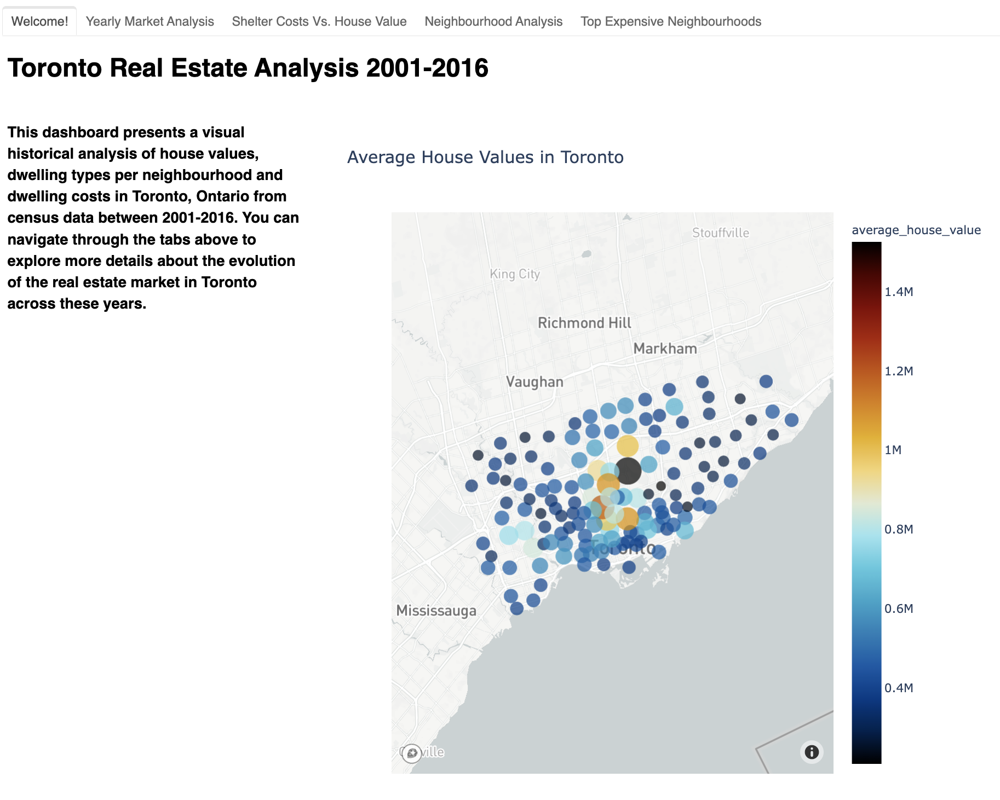
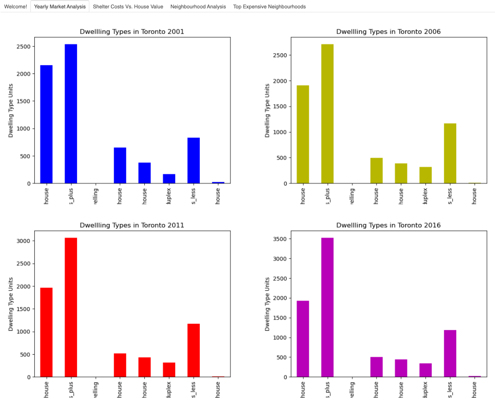
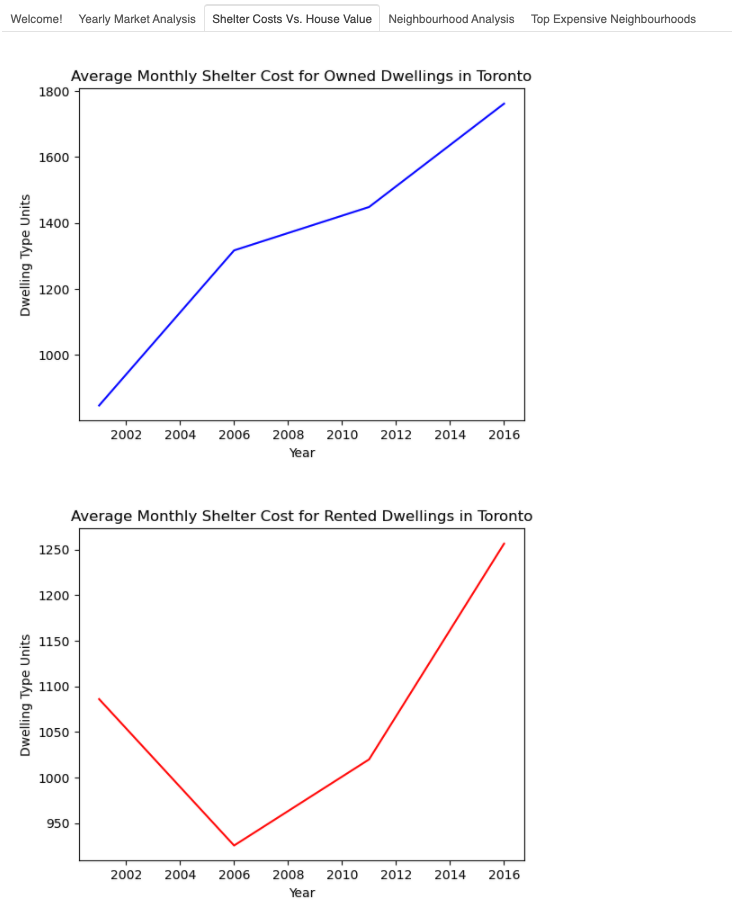
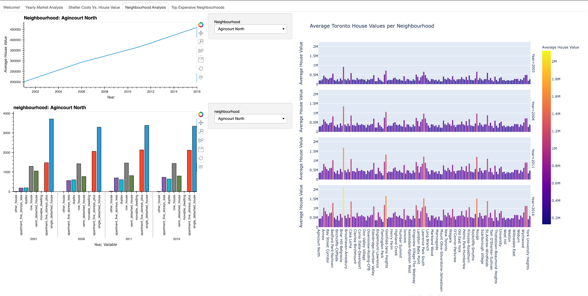
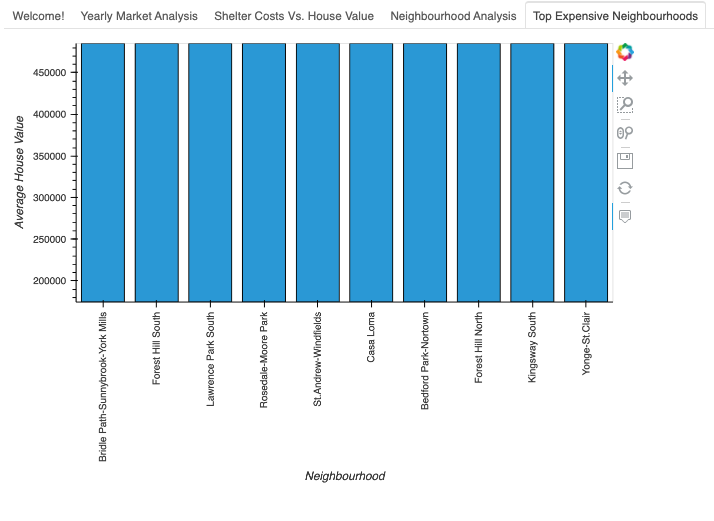

# Toronto Real Estate Analysis

*[Photo by James Wheeler](https://www.pexels.com/@souvenirpixels?utm_content=attributionCopyText&utm_medium=referral&utm_source=pexels) | [Free License](https://www.pexels.com/photo-license/)*

## Description
The purpose of this project is to create a Toronto real estate analysis dashboard to facilitate understanding of Toronto's real estate market for the purposes of making investment decisions. The data sources utilized in this project are from Toronto's neighbourhood census data gathered from the years 2001, 2006, 2011 and 2016. Toronto neighbourhood coordinates data is used for plotting Toronto neighbourhoods into a plotly express mapbox visualization.

The data utilized for this project was retrieved from the following websites:

* [Toronto Open Data](https://open.toronto.ca/)

* [Census Profile, 2016 Census - Toronto Metropolitan Area, Ontario and Canada](https://www12.statcan.gc.ca/census-recensement/2016/dp-pd/prof/details/page.cfm?Lang=E&Geo1=CMACA&Code1=535&Geo2=PR&Code2=01&SearchText=toronto&SearchType=Begins&SearchPR=01&B1=All&TABID=1&type=0)

# Environment Setup

It is recommended to install the PyViz visualization package to ensure everything runs as expected. PyViz is a Python visualization package that provides a single platform to access multiple visualization packages, including Matplotlib, Plotly Express, hvPlot, Panel, D3.js, etc.

Video Guide for installing PyViz: [PyViz Installation Video](https://youtu.be/ousjjkD4JbA) 

## Jupyter Notebook Instructions
In order to run both notebooks panel and its plotly extension, plotly express, hvplot, matplotlib, pandas, pathlib and dotenv libraries are required. A mapbox API key is also required to render the plotly express mapbox visualization.

## Running Dashboard via Command Line Interface (CLI)

In order to run the the panel dashboard via your local machine, follow the the steps below:

1. Open your CLI
2. Navigate to the location of this cloned repository
3. Execute `panel serve dashboard.ipynb`
4. Copy & paste the localhost address from your CLI to your browser.

Once loaded in your browser, the dashboard will appear as the screenshots below.

# Panel Dashboard

